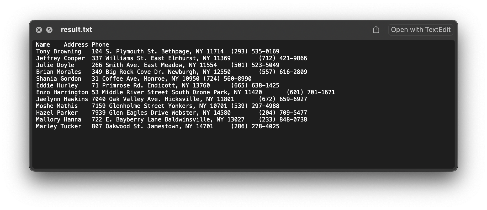

# <center>Personal data database project </center>

&nbsp;&nbsp;

# Introduction

This is a management database of personal data data. Including functions such as adding to the database, querying, displaying, and converting.

Information about each person includes:

* name
* address
* phone

Supported formats for personal data include:

* json
* yaml
* xml
* csv

Display format include:

* txt
* html

Convert format include:

* json

Usage modes include:

* api
* cmd

&nbsp;&nbsp;

# Environment dependent

python 37

macOS

&nbsp;&nbsp;

# Directory Structure

|                                   |                                                      |
|:--------------------------------- |:---------------------------------------------------- |
| ├─ code                           |                                                      |
| ├─├─ c00_buildPersonalDataset.py  | Build a testing personal data set                    |
| ├─├─ c01_readPersonalDataUtils.py | Functions of read personal data in different formats |
| ├─├─ c02_cacheSQLUtils.py         | Functions of SQL-based caching                       |
| ├─├─ c03_saveModuleUtils.py       | Functions of saved format                            |
| ├─├─ c04_api.py                   | API module                                           |
| ├─├─ c05_cli.py                   | Command Line module                                  |
| ├─├─ c06_main.py                  | API calling demo                                     |
| ├─ dataset                        |                                                      |
| ├─├─ rawData                      | Raw data random from website                         |
| ├─├─├─ rdmNameData.txt            | Random name data (10000x)                            |
| ├─├─├─ rdmAddressData.txt         | Random address data (10000x)                         |
| ├─├─├─ rdmPhoneData.txt           | Random phone data (10000x)                           |
| ├─├─ personalData                 | Simulate a dataset that stores personal data         |
| ├─├─├─ ****.json                  | Personal data                                        |
| ├─├─├─ ****.yaml                  | Personal data                                        |
| ├─├─├─ ****.xml                   | Personal data                                        |
| ├─├─├─ ****.csv                   | Personal data                                        |
| ├─├─├─ ****.txt                   | Simulate unsupposed format                           |
| ├─├─ cache                        | Sql database cache                                   |
| ├─ output                         |                                                      |
| ├─├─ result.txt                   | Query result (txt)                                   |
| ├─├─ result.html                  | Query result (html)                                  |
| ├─├─ convert                      | Convert result (json)                                |
| ├─ doc                            |                                                      |
| ├─ example                        | Example Display still                                |
|                                   |                                                      |

&nbsp;&nbsp;

# Uasge

## Generata a personal dataset

In order to simulate the data used, we constructed a dataset of personal information. 

There are 10k pieces of data in total, and 100 pieces of data are used here for testing. If you want to use more data for testing, you can modify the **dataCount** variable in the `./code/c00_buildPersonalDataset.py` file.

build the dataset with:

```
python3 ./code/c00_buildPersonalDataset.py 
```

&nbsp;&nbsp;

## CMD

* ## Help docuemnt:
  
       python3 ./code/c05_cli.py -h

&nbsp;&nbsp;

* ## Add personal data:
  
        python3 ./code/c05_cli.py --add Name Address Phone
        or 
        python3 ./code/c05_cli.py -a Name Address Phone
  
    example (add one data) : 
  
        python3 ./code/c05_cli.py --add juneleung BJChina +861234 
  
    example (add multi datas example) : 
  
        python3 ./code/c05_cli.py --add juneleung BJChina +861234 juneleung2 BJ2China +8612345

&nbsp;&nbsp;

* ## Duery personal data:
  
        python3 ./code/c05_cli.py --query Condiction
        or 
        python3 ./code/c05_cli.py -q Condiction
  
    example (query all data) : 
  
        python3 ./code/c05_cli.py --query ""
  
    example (query the data whose name is june ) : 
  
        python3 ./code/c05_cli.py --query "name=juneleung"
      
        # return with id, name ,address, phone
        # [(81, 'juneleung', 'Mars', '(+86) 123-4567'), (86, 'juneleung', 'BJChina', '+861234')]
  
    example (query the data whose name starts with june ) : 
  
        python3 ./code/c05_cli.py --query "name=june*"
      
        # return with id, name ,address, phone
        # [(81, 'juneleung', 'Mars', '(+86) 123-4567'), (85, 'juneleung2', 'Mars', '(+86) 123-4567'), (86, 'juneleung', 'BJChina', '+861234')]
  
    example (query the data whose address include NY ) : 
  
        python3 ./code/c05_cli.py --query "address=* NY *"
      
        #[(9, 'Tony Browning', '104 S. Plymouth St. Bethpage, NY 11714', '(293) 535-0169'), (13, 'Jeffrey Cooper', '337 Williams St. East Elmhurst, NY 11369', '(712) 421-9866'), (39, 'Julie Doyle', '266 Smith Ave. East Meadow, NY 11554', '(501) 523-5049'), (50, 'Brian Morales', '349 Big Rock Cove Dr. Newburgh, NY 12550', '(557) 616-2809'), (55, 'Shania Gordon', '31 Coffee Ave. Monroe, NY 10950', '(724) 560-8990'), (56, 'Eddie Hurley', '71 Primrose Rd. Endicott, NY 13760', '(665) 638-1425'), (63, 'Enzo Harrington', '53 Middle River Street South Ozone Park, NY 11420', '(601) 701-1671'), (69, 'Jaelynn Hawkins', '7040 Oak Valley Ave. Hicksville, NY 11801', '(672) 659-6927'), (70, 'Moshe Mathis', '7159 Glenholme Street Yonkers, NY 10701', '(539) 297-4988'), (72, 'Hazel Parker', '7939 Glen Eagles Drive Webster, NY 14580', '(204) 709-5477'), (78, 'Mallory Hanna', '722 E. Bayberry Lane Baldwinsville, NY 13027', '(233) 848-0738'), (80, 'Marley Tucker', '807 Oakwood St. Jamestown, NY 14701', '(286) 278-4025')]
  
    example (query the data whose phone starts with (880) ) : 
  
        python3 ./code/c05_cli.py --query "phone=(880)*"
      
        #[(18, 'Kylie Cohen', '7108 Cottage Drive Lanham, MD 20706', '(880) 232-6591'), (41, 'Deegan Anderson', '614 Fairground Ave. Mountain View, CA 94043', '(880) 745-6720')]

&nbsp;&nbsp;

* ## Convert personal data to json:
  
        python3 ./code/c05_cli.py --convert Outputpath
  
    example (convert all data) : 
  
        python3 ./code/c05_cli.py --convert ./output/convert

&nbsp;&nbsp;

* ## Display personal data to txt / json:
  
        python3 ./code/c05_cli.py --display Condiction Outputpath
        or 
        python3 ./code/c05_cli.py -d Condiction Outputpath
  
    example (display all data) : 
  
        python3 ./code/c05_cli.py --display "" ./output
  
    example (display the data whose address include NY ) : 
  
        python3 ./code/c05_cli.py --display "address=* NY *" ./output
      
        # **************************************************
        # ---- display records ----
        #
        # [(9, 'Tony Browning', '104 S. Plymouth St. Bethpage, NY 11714', '(293) 535-0169'), (13, 'Jeffrey Cooper', '337 Williams St. East Elmhurst, NY 11369', '(712) 421-9866'), (39, 'Julie Doyle', '266 Smith Ave. East Meadow, NY 11554', '(501) 523-5049'), (50, 'Brian Morales', '349 Big Rock Cove Dr. Newburgh, NY 12550', '(557) 616-2809'), (55, 'Shania Gordon', '31 Coffee Ave. Monroe, NY 10950', '(724) 560-8990'), (56, 'Eddie Hurley', '71 Primrose Rd. Endicott, NY 13760', '(665) 638-1425'), (63, 'Enzo Harrington', '53 Middle River Street South Ozone Park, NY 11420', '(601) 701-1671'), (69, 'Jaelynn Hawkins', '7040 Oak Valley Ave. Hicksville, NY 11801', '(672) 659-6927'), (70, 'Moshe Mathis', '7159 Glenholme Street Yonkers, NY 10701', '(539) 297-4988'), (72, 'Hazel Parker', '7939 Glen Eagles Drive Webster, NY 14580', '(204) 709-5477'), (78, 'Mallory Hanna', '722 E. Bayberry Lane Baldwinsville, NY 13027', '(233) 848-0738'), (80, 'Marley Tucker', '807 Oakwood St. Jamestown, NY 14701', '(286) 278-4025')]
  
  ### view a example output in html :
  
    `python3 ./code/c05_cli.py --display "address=* NY *" ./output `
  
    
  
  ### view a example output in txt:
  
    `python3 ./code/c05_cli.py --display "address=* NY *" ./output `
  
    
  
  ### view a example output in cli:
  
    `python3 ./code/c05_cli.py --display "name=june*" ./output `
  
    

&nbsp;&nbsp;

## API

        python ./code/c06_main.py

* ## Init PDapi
  
        personalDir: personal data directory
      
        cacheDir: cache directory
      
        cachedb: cache database name
      
        # init api 
        PD = PDapi(personalDir,cacheDir,cachedb)

* ## Query supposed formats list
  
        PD.PD_supposed_format()
      
        # print out: 
        # ('.yaml', '.json', '.xml', '.csv')

* ## Add new records
  
        Name = 'juneleung'
        Address = 'Mars'
        Phone = '(+86) 123-4567'
      
        # add a record
        newPersonalDataList = [(Name, Address, Phone)]
        PD.PD_add_record(newPersonalDataList)
      
        # print out: 
        # add success
        # data file has saved to ./dataset/personalData
      
        # add multi records:
        newPersonalDataList = [(Name1, Address1, Phone1),(Name2, Address2, Phone2),...]
        PD.PD_add_record(newPersonalDataList)

* ## Query search the records
  
        # query all the records
        res = PD.PD_search_records()
      
        # fuzzy search: name begin with "Aracely" 
        res1 = PD.PD_search_records("name=Aracely*") 
      
        # exact search: name is "Aracely Good"
        res = PD.PD_search_records("name=Aracely Good") 
      
        # fuzzy search: address in "NY"
        res = PD.PD_search_records("address=*NY*") 
      
        # fuzzy search: phone begin with "(800)"
        res = PD.PD_search_records("phone=(880)*") 
      
        # print out the res
        print(res1)
        # [(30, 'Aracely Good', '8345 Longfellow St. Mays Landing, NJ 08330', '(912) 486-9982')]

* ## Save the records to local file
  
        # save html / txt
        PD.PD_display_records(res,outputPath)

&nbsp;&nbsp;

# Release Notes

##### v 1.0.0: Complete basic functions

&nbsp;&nbsp;

# Acknowledge

The simuklated personal datas used in the test is generated from the following website:

[fake-name-generator](https://www.randomlists.com/fake-name-generator?qty=10000)

[fake-addresses-generator](https://www.randomlists.com/random-addresses?qty=1000)

[fake-phone-numbers-generator](https://www.randomlists.com/phone-numbers?dup=false&qty=10000)

# Contact

JunLiang Chen / Juneleung Chan

juneleungchan@163.com

2023-06-10